## LABORATORIO 06 DE DESARROLLO DE APLICACIONES EMPRESARIALES
# INTEGRANTES: 
# 1. Bellido Chambi Rony Widmer
# 2. Rojas Tello, Mauricio Lucianno
# 3. Xiomara Garcia Silva

## 📸 Capturas del proyecto
#
### 🔹 Mauricio Rojas :
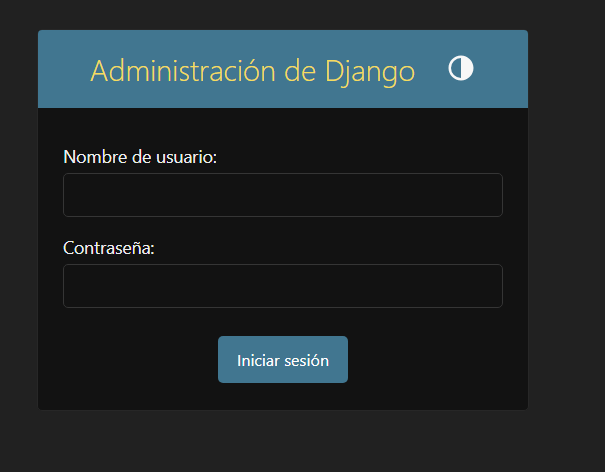

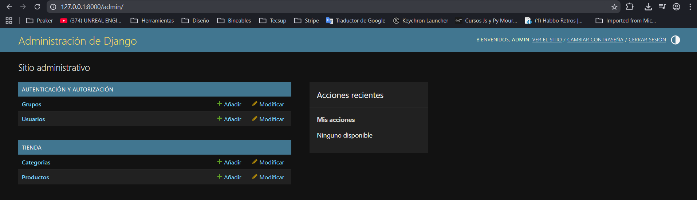

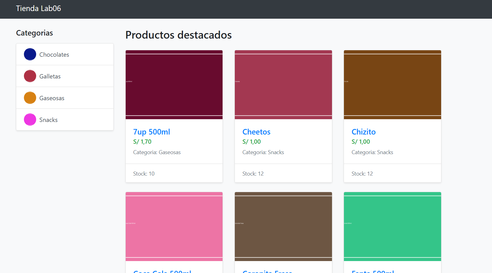

# 3. XIOMARA GARCIA SILVA

📸 Capturas del proyecto

🔹 GET /api/genres/  
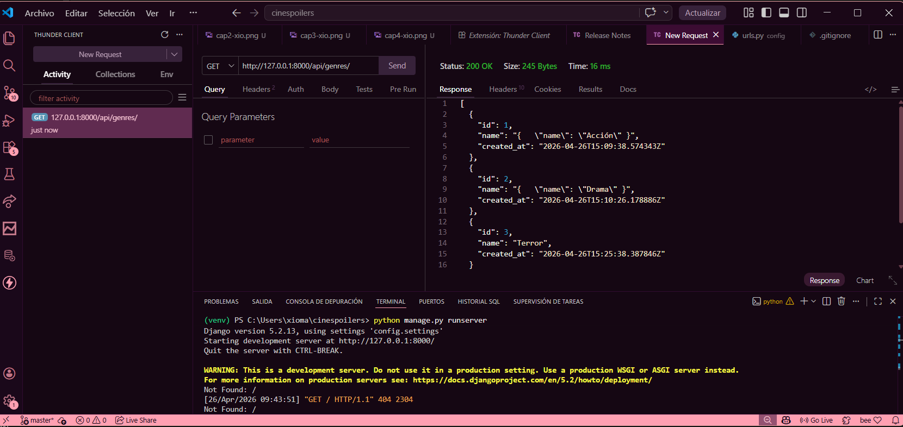

🔹 POST /api/genres/  
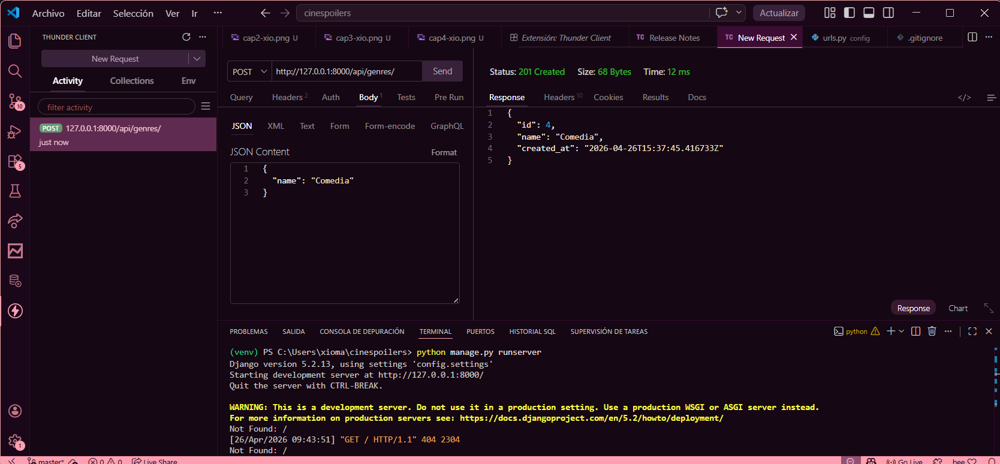

🔹 GET /api/movies/  
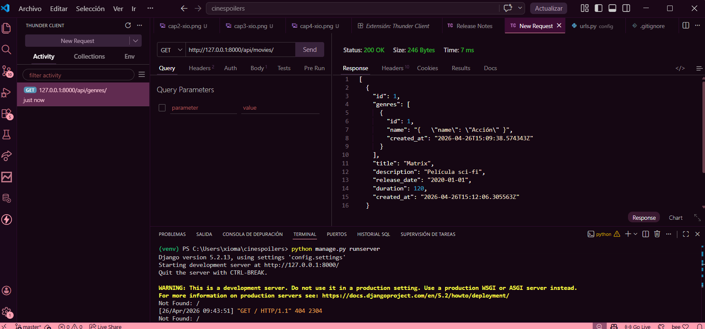

🔹 POST /api/movies/  
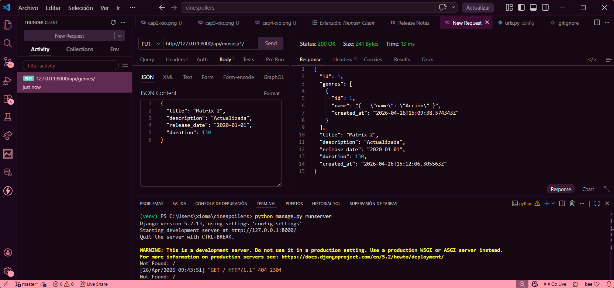

🔹 PUT /api/movies/1/  
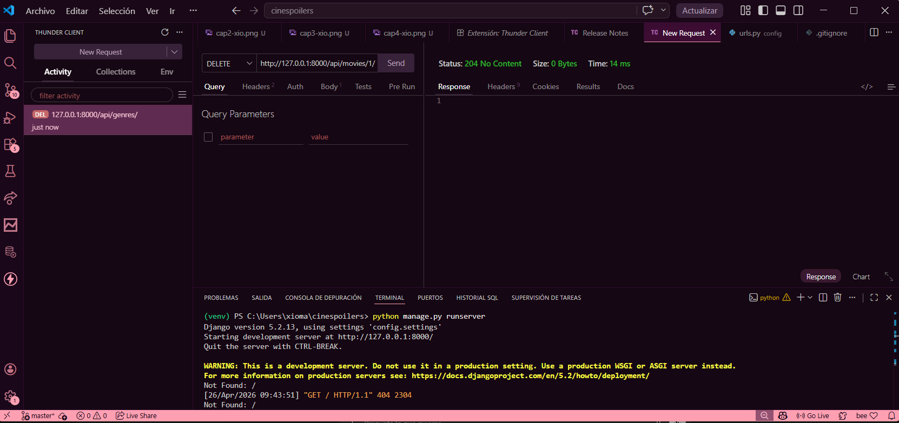

🔹 DELETE /api/movies/1/  
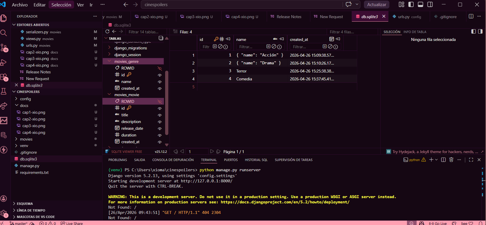

🔹 Base de datos  

# 1. Bellido Chambi Rony Widmer

### 🔹 GET http://127.0.0.1:8000/api/genres/ :
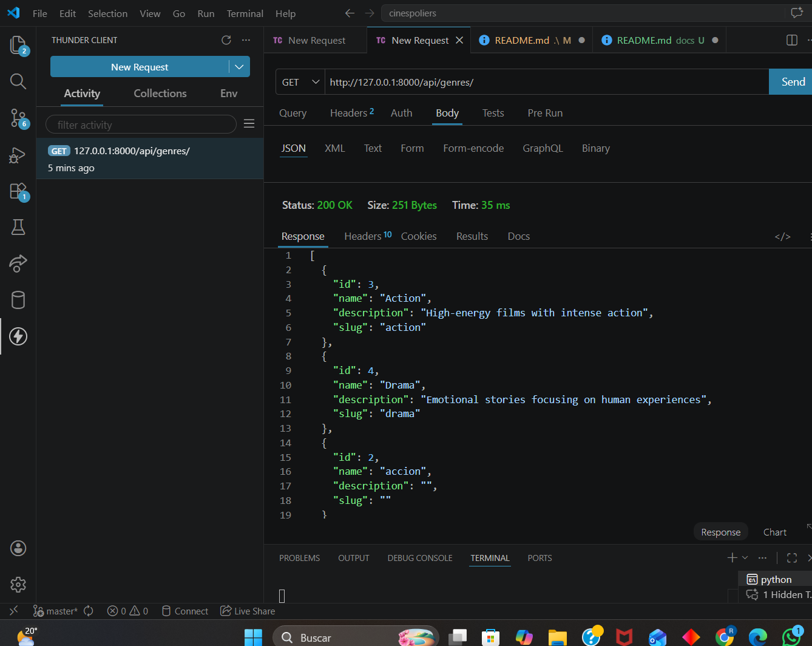

### 🔹 GET POR ID http://127.0.0.1:8000/api/genres/5 :
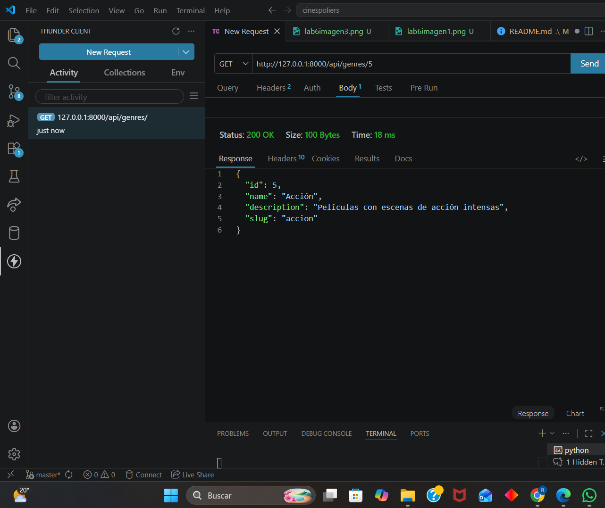

### 🔹 POST http://127.0.0.1:8000/api/genres/ :
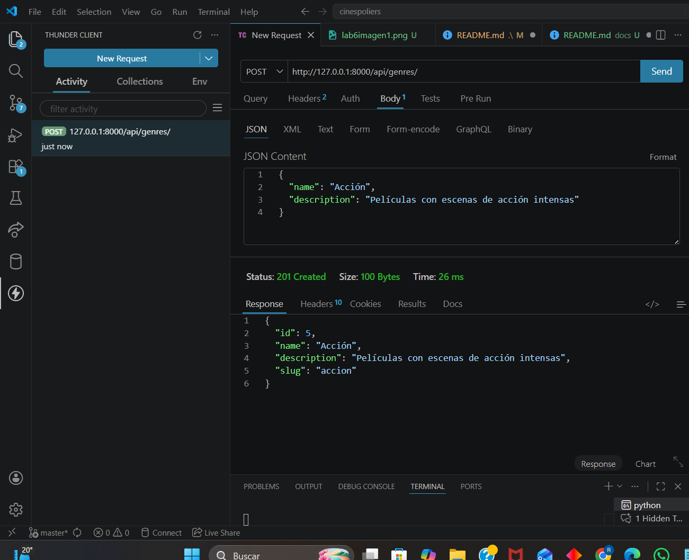

### 🔹 PUT http://127.0.0.1:8000/api/genres/5/ :
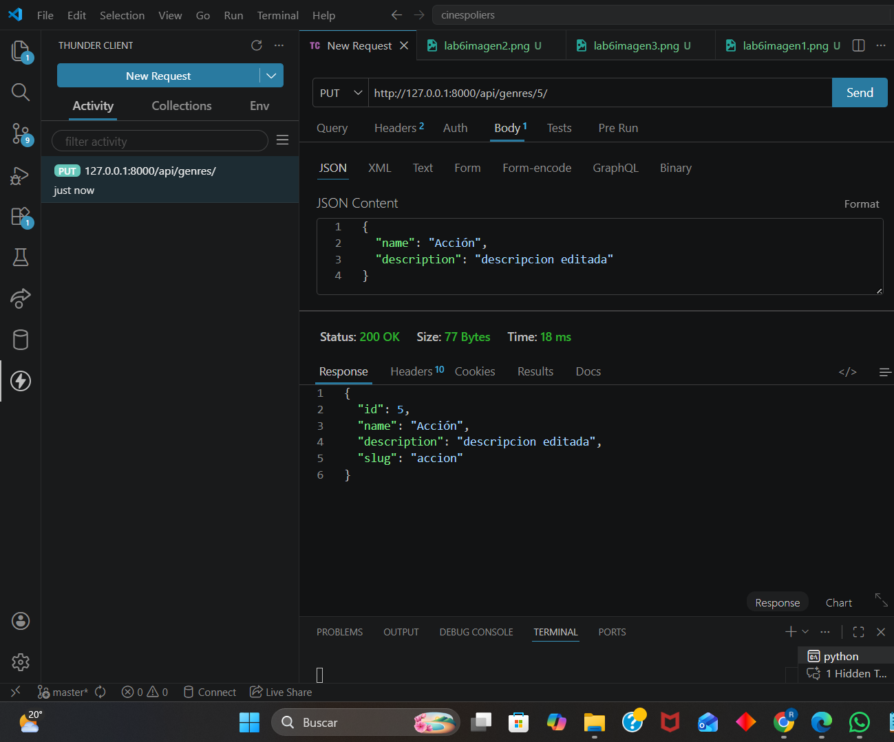

### 🔹 DELETE http://127.0.0.1:8000/api/genres/5/ :
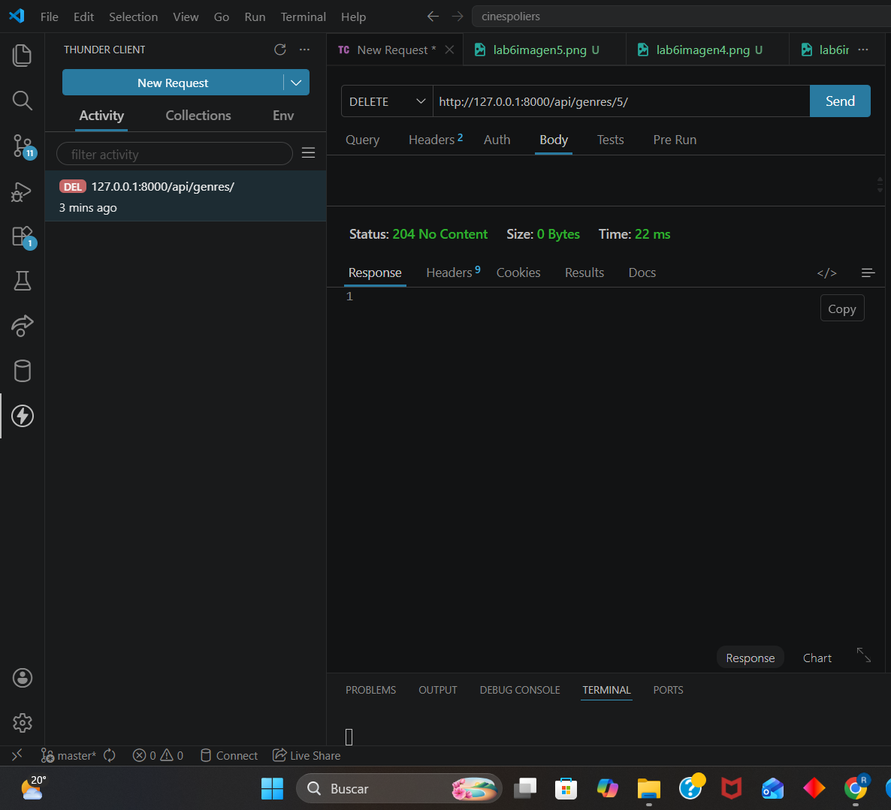
